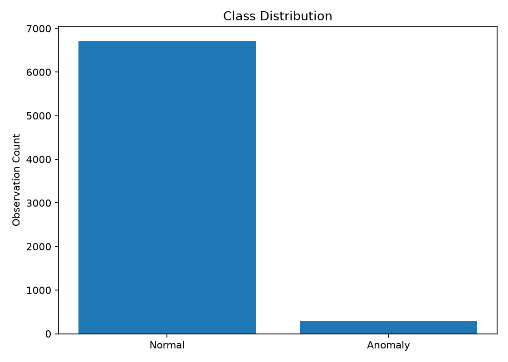
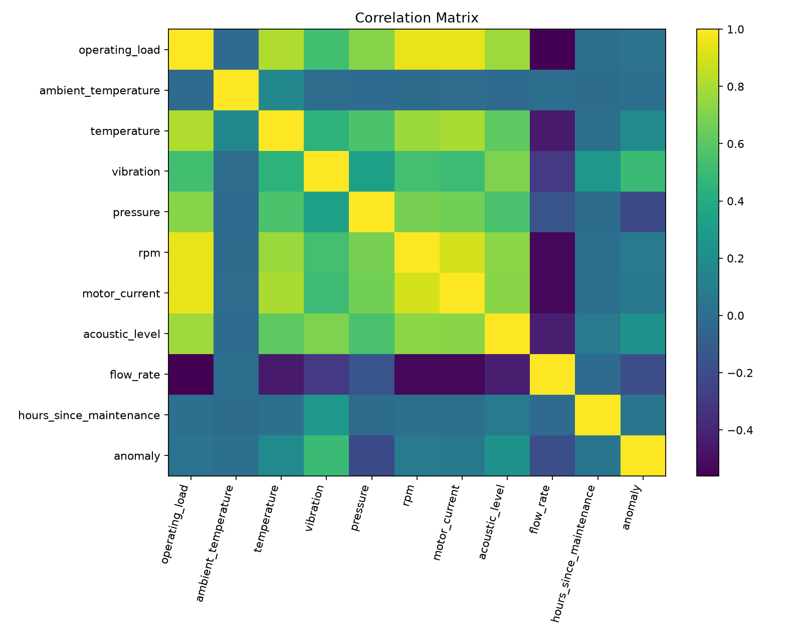
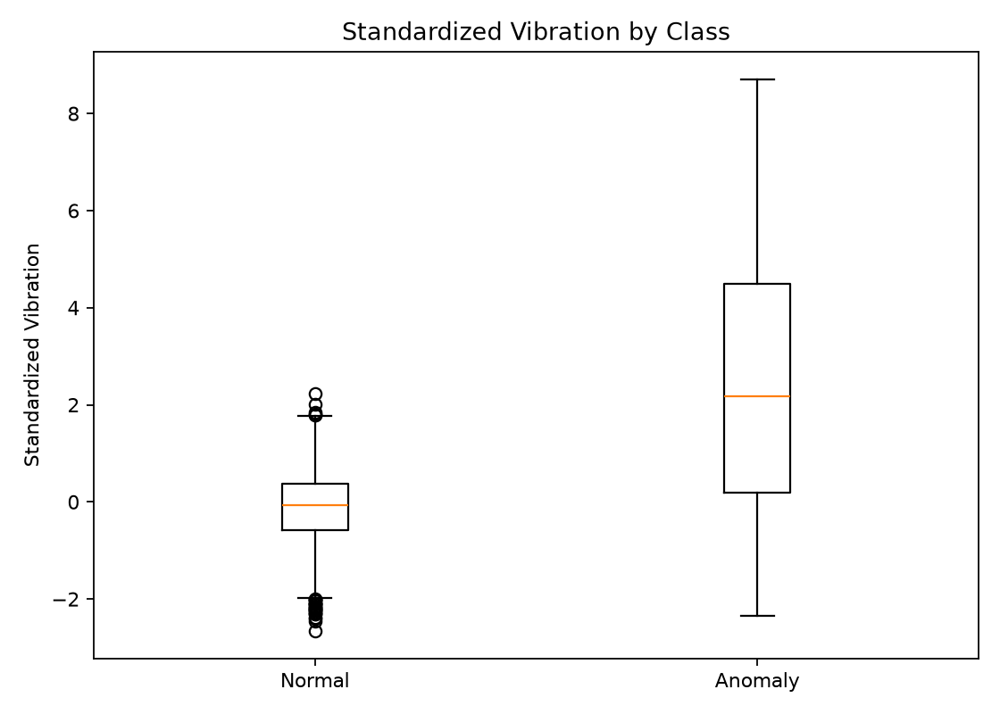

Predictive Maintenance Anomaly Detection

Safety-oriented anomaly detection on synthetic industrial telemetry

An end-to-end machine-learning project that detects rare machine anomalies, compares tree-based and neural models, handles class imbalance, measures false negatives and evaluates performance under simulated data drift.

Why this project?

In industrial systems, most sensor observations are normal and true failures are rare. A model can therefore achieve high accuracy simply by predicting normal almost all the time.

That is not enough for a safety-oriented system.

This project focuses on the questions that matter in practice:

How many real anomalies does the model detect?

How many dangerous events does it miss?

Does class weighting improve rare-event detection?

How fast can the model make a prediction?

What happens when operating conditions drift?

Which model should be preferred when false negatives are costly?

System overview

flowchart LR
    A[Synthetic telemetry generation] --> B[Chronological split]
    B --> C[Exploratory data analysis]
    B --> D1[XGBoost baseline]
    B --> D2[XGBoost weighted]
    B --> E1[Neural net baseline]
    B --> E2[Neural net weighted]

    D1 --> F[Validation-based threshold selection]
    D2 --> F
    E1 --> F
    E2 --> F

    F --> G[Clean test evaluation]
    G --> H[Drift simulation]
    H --> I[Drifted test evaluation]
    I --> J[Safety-oriented model decision]
    J --> K[Markdown, CSV, JSON, PNG and model outputs]

Dataset

The project generates 10,000 synthetic industrial telemetry observations representing multiple machines over time.

Each row contains:

Feature

Meaning

operating_load

Current machine workload

ambient_temperature

Environmental temperature

temperature

Machine temperature

vibration

Mechanical vibration level

pressure

Operating pressure

rpm

Rotational speed

motor_current

Electrical current drawn by the motor

acoustic_level

Machine noise level

flow_rate

Process flow measurement

hours_since_maintenance

Time since the last maintenance operation

Target:

anomaly = 0  → normal operation
anomaly = 1  → anomalous or failure-like behaviour

Synthetic failure patterns include:

Overheating

Bearing-related vibration faults

Pressure faults

Overspeed events

Combined multi-sensor faults

The anomaly prevalence is approximately 4%, creating a realistic class-imbalance problem.

Exploratory data analysis

The pipeline automatically produces:

Class-distribution analysis

Feature-summary statistics

Feature means by class

Correlation matrix

Standardized vibration comparison

CSV and PNG outputs

 

Models

Four experiments are trained and evaluated:

Experiment

Algorithm

Imbalance strategy

XGBoost Baseline

Gradient-boosted decision trees

None

XGBoost Weighted

Gradient-boosted decision trees

scale_pos_weight

Neural Net Baseline

Feed-forward PyTorch network

None

Neural Net Weighted

Feed-forward PyTorch network

Weighted binary cross-entropy

Neural-network architecture

Input features
    ↓
Linear(10 → 48) + ReLU + Dropout
    ↓
Linear(48 → 24) + ReLU + Dropout
    ↓
Linear(24 → 1)
    ↓
Anomaly probability

A feed-forward neural network was selected instead of an LSTM because each row is treated as a telemetry snapshot. The architecture can later be extended to rolling windows and sequence modelling.

Class imbalance handling

Rare anomalies make ordinary accuracy misleading.

The project therefore evaluates both unweighted and weighted training.

XGBoost

scale_pos_weight = negative_samples / positive_samples

Neural network

BCEWithLogitsLoss(pos_weight=...)

Class weighting is treated as an experiment rather than an automatic improvement. The results show whether weighting truly reduces missed anomalies or merely creates more false alarms.

Evaluation strategy

The dataset is split chronologically, not randomly:

70% training
15% validation
15% testing

This prevents future observations from leaking into the training set and better reflects real deployment.

The project measures:

Precision

Recall

F1-score

False-negative rate

False-positive rate

Specificity

ROC-AUC

Average Precision

Single-observation inference latency

Why false negatives matter

A false negative means:

The machine is actually anomalous, but the model predicts normal.

In a safety-critical environment, this can be more costly than a false alarm. Therefore the model-selection logic prioritizes:

Worst-case recall

Worst-case false-negative rate

Precision

Inference latency

The classification threshold is selected using the validation set only. Test labels are never used for threshold tuning.

Reference results

The repository contains outputs from one reproducible reference run. Exact neural-network results may vary slightly across hardware and library versions.

Clean test set

Model

Precision

Recall

F1

False-negative rate

Latency

Neural Net Baseline

86.15%

93.33%

89.60%

6.67%

0.124 ms

Neural Net Weighted

75.68%

93.33%

83.58%

6.67%

0.130 ms

XGBoost Weighted

98.21%

91.67%

94.83%

8.33%

0.194 ms

XGBoost Baseline

94.83%

91.67%

93.22%

8.33%

0.173 ms

Interpretation

Neural Net Baseline achieved the highest recall and the lowest false-negative rate.

XGBoost Weighted produced the strongest overall F1 and precision.

Weighting improved XGBoost in the reference run.

Weighting did not improve the neural network because recall stayed constant while precision decreased.

The preferred model depends on the operational cost of missed anomalies versus false alarms.

The automatic safety-oriented selection chose:

Neural Net Baseline

because it missed fewer true anomalies than the XGBoost models.

Drift simulation

A model can perform well during testing and still fail after operating conditions change.

The project simulates covariate drift by modifying:

Ambient temperature

Machine temperature

Operating load

Vibration

Pressure

RPM

Motor current

Acoustic level

Flow rate

Maintenance age

Feature drift is quantified with Population Stability Index (PSI).

General interpretation:

PSI < 0.10       → low drift
0.10 ≤ PSI < 0.25 → moderate drift
PSI ≥ 0.25       → high drift

The drift experiment demonstrates an important operational lesson:

High recall can remain intact while precision collapses because the model begins raising too many false alarms.

This is why production ML systems require monitoring, recalibration and periodic validation instead of one-time model training.

Project structure

predictive-maintenance-anomaly-lab/
├── data/
│   ├── telemetry.csv
│   └── telemetry_drifted_test.csv
├── outputs/
│   ├── REPORT.md
│   ├── summary.json
│   ├── eda/
│   ├── metrics/
│   └── models/
├── src/
│   ├── config.py
│   ├── data_generation.py
│   ├── drift.py
│   ├── eda.py
│   ├── metrics.py
│   ├── pipeline.py
│   ├── report.py
│   └── models/
│       ├── neural_net.py
│       └── xgboost_model.py
├── tests/
├── predict_example.py
├── run_project.py
├── START_PROJECT.bat
├── RUN_ONLY.bat
├── RUN_TESTS.bat
├── requirements.txt
└── README.md

Quick start

Windows — easiest method

Double-click:

START_PROJECT.bat

The script automatically:

Creates a virtual environment

Installs dependencies

Runs the full pipeline

Saves all outputs

PyCharm or terminal

python -m venv .venv
.\.venv\Scripts\activate
python -m pip install --upgrade pip
python -m pip install -r requirements.txt
python run_project.py

Faster development run

python run_project.py --samples 5000 --epochs 15

Run tests

python -m pytest -q

Run a saved-model prediction example

python predict_example.py

Generated outputs

After execution, the most important files are:

outputs/REPORT.md
outputs/summary.json
outputs/metrics/model_comparison_clean.csv
outputs/metrics/model_comparison_default_threshold_0_50.csv
outputs/metrics/model_comparison_drift.csv
outputs/metrics/feature_drift_summary.csv
outputs/eda/class_distribution.png
outputs/eda/correlation_matrix.png
outputs/eda/vibration_by_class.png

Saved models:

outputs/models/xgboost_baseline.json
outputs/models/xgboost_weighted.json
outputs/models/neural_net_baseline.pt
outputs/models/neural_net_weighted.pt

Safety-critical conclusion

For an environment where missing a real anomaly is more costly than investigating a false alarm, the Neural Net Baseline is the conservative candidate in the reference run.

For an environment where alarm quality and technician workload matter more, XGBoost Weighted may be preferable because it provides stronger precision and F1.

A real industrial decision should also consider:

Cost of an undetected failure

Cost of unnecessary maintenance

Alarm-fatigue risk

Sensor reliability

Failure severity

Model uncertainty

Human escalation procedures

Redundant engineering safeguards

Limitations

This project is designed for learning and portfolio demonstration.

The data is synthetic.

The anomaly mechanisms are simplified.

The neural network uses independent snapshots rather than temporal windows.

Drift is simulated rather than observed in production.

No model should be used as the sole safety barrier.

Real deployment requires real historical failures, time-based validation, domain-expert review, monitoring and engineering redundancy.

What this project demonstrates

Synthetic industrial-data generation

Rare-event classification

XGBoost and PyTorch modelling

Class-imbalance handling

Threshold optimization

Safety-oriented evaluation

False-negative analysis

Inference benchmarking

Covariate-drift simulation

PSI-based monitoring

Automated reporting

Reproducible project organization

Author

Oğuzhan BekmezciStatistics graduate focused on data science, machine learning and applied AI engineering.

License

This project is licensed under the MIT License.
